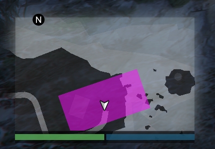

# Blips



You can find blips sprite and colors ids here [https://docs.fivem.net/docs/game-references/blips/](https://docs.fivem.net/docs/game-references/blips/)


### Environment

For this examples we will use config file with some data that specify how will blip look and what type of display we will use, most of function for rcore that create something has default values in rcore config.lua, blip is not a exeption

#### Blip options


This is default options, if you write any option as last parameter in blip create function it will replace default parameters from rcore, so you can setup your own parameters or use defaults



```lua
Config.DefaultBlipOptions = {
    scale = 1.0, --Scale of blip
    shortRange = true, --Short range option (blip will show only at short range)
    type = 4, --Display type 
    color = 55, --Blip color
    blip = -1 --Blip sprite
}
```


#### Config


```lua
Config.Blip = {
    x = -31.98,
    y = -1652.13,
    z = 29.49,
    type = 2, -- display type
    blip = 524, -- blip sprite
    color = 58, -- blip color
    name = "Car bazar" -- blip label
}
```



Display type is parameter that is used in native SetBlipDisplay  
[https://runtime.fivem.net/doc/natives/?\_0x9029B2F3DA924928](https://runtime.fivem.net/doc/natives/?_0x9029B2F3DA924928)  
  
0 - doesnt show anywhere  
2 - show on main map and minimap  
4 - show only at main map   
  
For more look at link above


### Classic blips


```lua
rcore = exports.rcore

local blip

Citizen.CreateThread(function()
    blip = rcore:createBlip(Config.Blip.name, Config.Blip.blip, vector3(Config.Blip.x, Config.Blip.y, Config.Blip.z), {
        type = Config.Blip.type,
        color = Config.Blip.color
    })
end)
```


### Area blip


```lua
rcore = exports.rcore

local blip

Citizen.CreateThread(function() 
    blip = rcore:createAreaBlip(vector3(area.x,area.y,area.z),area.rotation,area.width,area.height)
end)
```



rcore area blip is using native [https://runtime.fivem.net/doc/natives/?\_0xCE5D0E5E315DB238](https://runtime.fivem.net/doc/natives/?_0xCE5D0E5E315DB238)




### Removing blip


```lua
rcore = exports.rcore

rcore:removeBlip(blip)
```


### Using natives

All create function return real blip id so you can use it with any native function for example


```lua
rcore = exports.rcore

local blip

Citizen.CreateThread(function()
    blip = rcore:createBlip(Config.Blip.name, Config.Blip.blip, vector3(Config.Blip.x, Config.Blip.y, Config.Blip.z), {
        type = Config.Blip.type,
        color = Config.Blip.color
    })
    
    SetBlipFlashes(blip,true)
    SetBlipAlpha(blip, 50)
    --Or change color
    SetBlipColour(blip, 5)
end)
```



